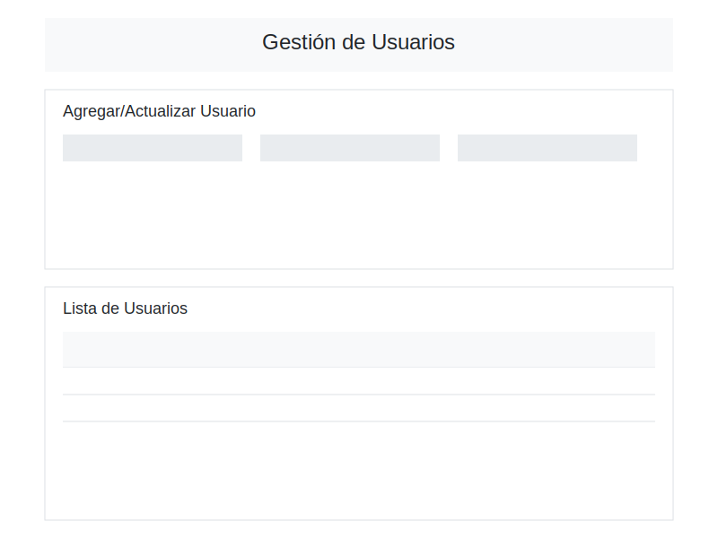

# Frontend de Gestión de Usuarios

## Información del Proyecto
- **Título**: Aplicación Web para Gestión de Usuarios
- **Estudiante**: Edison Arambulo
- **Fecha**: 30 de Mayo de 2025

## Introducción
Esta aplicación web proporciona una interfaz de usuario moderna y responsiva para gestionar usuarios a través de una API RESTful. Permite realizar todas las operaciones CRUD (Crear, Leer, Actualizar, Eliminar) sobre usuarios de manera intuitiva y eficiente.

## Requisitos del Proyecto

### Funcionalidades Implementadas
- Listado de usuarios con información detallada
- Formulario para crear nuevos usuarios
- Edición de usuarios existentes
- Eliminación de usuarios
- Búsqueda de usuarios por ID
- Interfaz responsiva y amigable
- Manejo de errores y validaciones
- Feedback visual de operaciones

### Tecnologías Utilizadas
- HTML5
- CSS3 (con diseño responsivo)
- JavaScript (ES6+)
- Fetch API para comunicación con el backend
- Bootstrap para estilos

## Interfaz de Usuario

### Vista Principal


La interfaz principal cuenta con:
1. Formulario para crear/editar usuarios en la parte superior
2. Lista de usuarios existentes en la parte inferior
3. Barra de búsqueda por ID integrada

## Implementación del Proyecto

### Estructura del Código
```
frontend-app/
├── index.html      # Página principal
├── app.js         # Lógica de la aplicación
└── styles.css     # Estilos personalizados
```

### Componentes Principales
1. **Formulario de Usuario**
   - Campos para toda la información del usuario
   - Validación de datos
   - Modo de creación y edición

2. **Tabla de Usuarios**
   - Listado de todos los usuarios
   - Botones de acción por usuario
   - Ordenamiento y filtrado

3. **Barra de Búsqueda**
   - Búsqueda por ID
   - Botón para mostrar todos los usuarios

### Funciones JavaScript
- `loadUsers()` - Carga y muestra todos los usuarios
- `handleSubmit()` - Maneja la creación de usuarios
- `handleUpdate()` - Gestiona la actualización de usuarios
- `deleteUser()` - Elimina usuarios
- `editUser()` - Carga usuario para edición
- `handleSearch()` - Busca usuarios por ID

## Instrucciones de Ejecución

### Requisitos Previos
1. Navegador web moderno
2. Servidor HTTP local (por ejemplo, `http-server`)

### Configuración Local
1. Clonar el repositorio
2. Instalar dependencias:
   ```bash
   npm install -g http-server
   ```
3. Iniciar el servidor:
   ```bash
   http-server ./frontend-app -p 8080 --cors
   ```
4. Abrir en el navegador:
   ```
   http://localhost:8080
   ```

## Uso de la Aplicación

### Crear Usuario
1. Llenar el formulario con los datos del usuario
2. Hacer clic en "Guardar"
3. Verificar el mensaje de éxito

### Editar Usuario
1. Hacer clic en "Editar" junto al usuario deseado
2. Modificar los campos necesarios
3. Hacer clic en "Actualizar"

### Eliminar Usuario
1. Hacer clic en "Eliminar" junto al usuario
2. Confirmar la eliminación
3. Verificar que el usuario ya no aparece en la lista

### Buscar Usuario
1. Ingresar el ID en el campo de búsqueda
2. Hacer clic en "Buscar"
3. Para ver todos los usuarios nuevamente, hacer clic en "Ver Todos"

## Conclusiones
Esta aplicación frontend demuestra la implementación de una interfaz de usuario moderna y funcional para la gestión de usuarios. Las principales características incluyen:
- Diseño intuitivo y responsivo
- Manejo robusto de errores
- Feedback claro al usuario
- Integración seamless con el backend

### Desafíos Superados
- Implementación de validaciones en tiempo real
- Manejo de estados del formulario
- Integración con la API RESTful
- Diseño responsivo para diferentes dispositivos

## Referencias
- [MDN Web Docs](https://developer.mozilla.org/)
- [Bootstrap Documentation](https://getbootstrap.com/docs/)
- [JavaScript Fetch API](https://developer.mozilla.org/en-US/docs/Web/API/Fetch_API)
